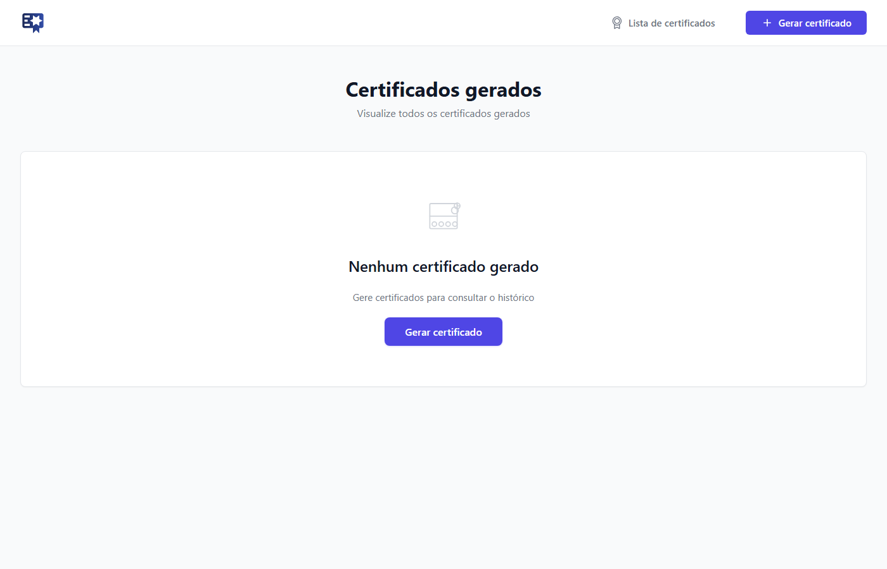
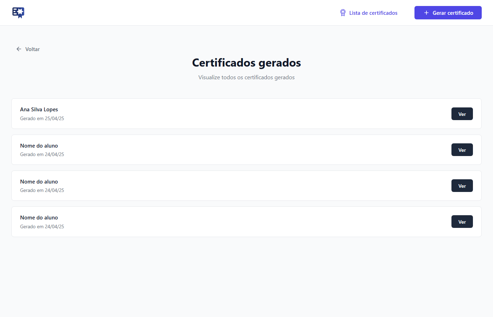
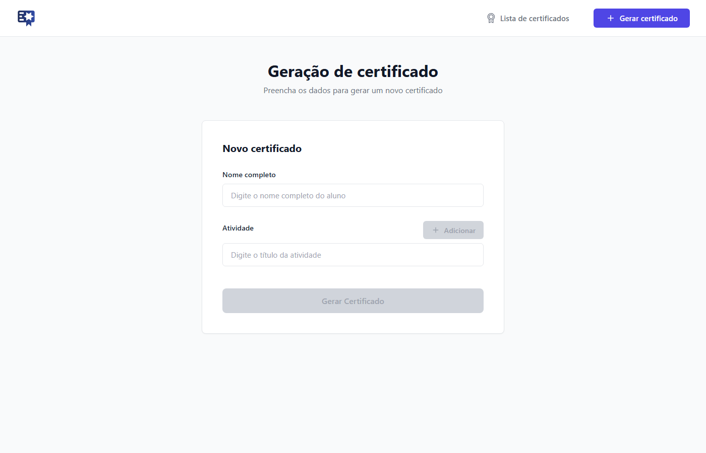

<div align="center">

# 🎓 Gerador de Certificado

**Aplicação web para criar, listar e emitir certificados de conclusão de curso de forma rápida, elegante e personalizável.**

<!-- ✏️ TROQUE os badges abaixo se mudar de licença, ou adicione o badge de Stars quando o repositório for público -->


<!-- ✏️ TROQUE <seu-usuario> pelo seu usuário/organização do GitHub -->


</div>

---

## 📖 Sobre o projeto

O **Gerador de Certificado** é uma aplicação Angular que permite emitir certificados de conclusão de curso de maneira simples e visualmente profissional. Basta informar o nome do aluno e as atividades concluídas para gerar um certificado pronto para download, com identidade visual própria (logo, selo e assinatura personalizados).

Ideal para escolas, cursos livres, bootcamps e instrutores independentes que precisam emitir certificados sem depender de ferramentas pagas ou templates genéricos.

---

## 🖼️ Preview

<!-- ✏️ TROQUE as imagens da pasta docs/ pelas capturas de tela atualizadas do seu projeto, se necessário -->

| Home | Lista de Certificados |
|:---:|:---:|
|  |  |

| Gerar Certificado | Certificado Final |
|:---:|:---:|
|  |  |

---

## ✨ Funcionalidades

- ✅ Geração de certificados personalizados por nome e atividades
- ✅ Listagem de todos os certificados já emitidos
- ✅ Visualização individual do certificado gerado
- ✅ Download do certificado
- ✅ Identidade visual própria (logo, selo e assinatura customizados)
- ✅ Navegação fluida entre as páginas com Angular Router
- ✅ Interface 100% responsiva

---

## 🛠️ Tecnologias Utilizadas

- ⚡ [Angular 22](https://angular.dev/)
- 🟦 TypeScript
- 🌐 HTML5
- 🎨 CSS3
- 🧭 Angular Router
- 📝 Angular Forms
- 🧪 [Vitest](https://vitest.dev/) — testes unitários
- 🟢 Node.js
- 📦 npm

---

## 📂 Estrutura do Projeto

```
src/
├── app/
│   ├── _components/
│   │   ├── back-button/          # Botão de voltar reutilizável
│   │   ├── certificate-item/     # Item da lista de certificados
│   │   └── navbar/               # Barra de navegação
│   ├── models/
│   │   └── certificate.model.ts  # Modelo de dados do certificado
│   ├── pages/
│   │   ├── home/                       # Página inicial
│   │   ├── certificates-list/          # Lista de certificados gerados
│   │   ├── generate-certificate/       # Formulário de geração
│   │   └── certificate-detail/         # Visualização do certificado final
│   ├── services/
│   │   └── certificate.ts        # Regras de negócio e estado dos certificados
│   ├── app.routes.ts              # Definição das rotas
│   └── app.ts                     # Componente raiz
├── styles.css                     # Estilos globais
└── main.ts                        # Bootstrap da aplicação

public/
└── images/                        # Ativos estáticos (logo, selo, etc.)
```

---

## 🚀 Como Executar o Projeto

### Pré-requisitos

- [Node.js](https://nodejs.org/) 18 ou superior
- npm

### Passo a passo

```bash
# 1. Clone o repositório
# ✏️ TROQUE <seu-usuario> pelo seu usuário/organização do GitHub
git clone https://github.com/<seu-usuario>/gerador-certificado.git

# 2. Acesse a pasta do projeto
cd gerador-certificado

# 3. Instale as dependências
npm install

# 4. Execute o projeto
npm start
```

Após iniciar, acesse:

```
http://localhost:4200
```

A aplicação recarrega automaticamente a cada alteração nos arquivos-fonte.

---

## 📦 Build

Para gerar a versão de produção:

```bash
npm run build
```

Os artefatos de build ficam disponíveis na pasta `dist/`, prontos para deploy.

---

## 🧪 Testes

Para executar os testes unitários com [Vitest](https://vitest.dev/):

```bash
npm test
```

---

## 📱 Responsividade

A aplicação foi desenvolvida com layout totalmente responsivo, garantindo uma boa experiência em:

| 🖥️ Desktop | 💻 Notebook | 📱 Tablet | 📲 Mobile |
|:---:|:---:|:---:|:---:|
| ✅ | ✅ | ✅ | ✅ |

---

## 🗺️ Roadmap / Próximas Melhorias

- [ ] Exportação do certificado em PDF
- [ ] Compartilhamento do certificado via link/redes sociais
- [ ] Busca de certificados por nome do aluno
- [ ] Filtro de certificados por data de emissão
- [ ] Tema Dark Mode
- [ ] Integração com API/backend para persistência dos dados

---

## 👩‍💻 Sobre a Desenvolvedora

<!-- ✏️ TROQUE pelo seu nome, GitHub e LinkedIn -->
Desenvolvido por **Seu Nome**

[](https://github.com/<seu-usuario>)
[](https://linkedin.com/in/<seu-usuario>)

---

## ⭐ Gostou do projeto?

Se este projeto foi útil ou te inspirou de alguma forma, considere deixar uma ⭐ no repositório — isso ajuda muito a dar visibilidade ao trabalho!

<!-- ✏️ TROQUE pela licença real do projeto, se for diferente de MIT -->
## 📄 Licença

Este projeto está sob a licença MIT. Veja o arquivo [LICENSE](LICENSE) para mais detalhes.

